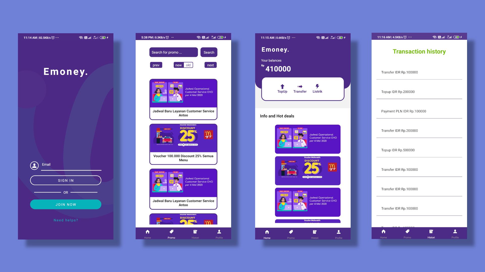
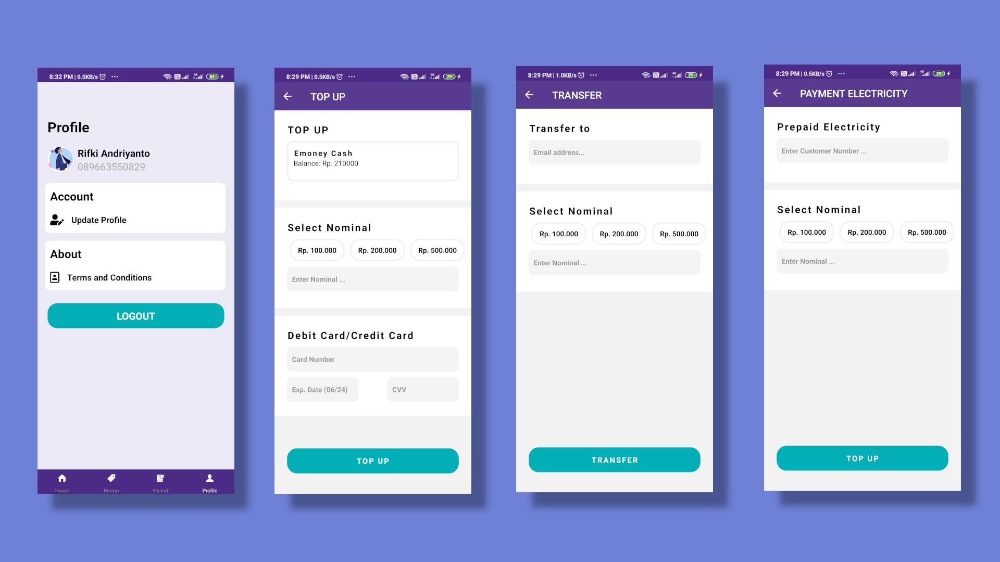

# Emoney

## Description :clipboard:

> Emoney is an e-wallet / fintech mobile application with a design similar to [OVO by Tokopedia](https://www.ovo.id/). With the top up feature, transfer between friends using email, pay prepaid electricity, and the transaction history feature to view transaction records and promo info. This application is made with React native on the mobile side, and for the backend using express js, nodemailer for smtp, and Mysql as the database.

## App Demo

## Installation :wrench:

-   Clone backend repo by running `git clone git@github.com:rifkiandriyanto/emoney-backend`
-   Clone this repo by running `git clone git@github.com:rifkiandriyanto/emoney-mobile`

### Server setup

-   Create .env first
-   `cd emoney-backend`
-   `yarn`
-   `yarn start`

### Client setup

-   `cd emoney-mobile`
-   `yarn`
-   `yarn start`
-   Client will be available at `localhost:3000`

## Built With :zap:

1. Node
2. Express
3. MySql
4. React Native
6. Redux

## License

-   **[MIT license](http://opensource.org/licenses/mit-license.php)**